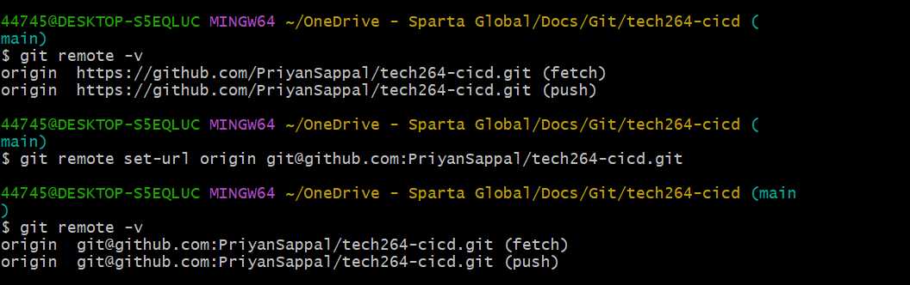

# Steps to get your SSH key to GitHub

## 1. Create SSH key pair 
## 2. Register the padlock
## 3. Add private key to SSH register
## 4. Create test repo
## 5. Push changes to test repo

1. Generate a new SSH key. `ssh-keygen -t rsa -b 4096 -C "your email address"`
2. Print the **public** key using `cat`. This will be given to GitHub.
3. Navigate to your **Settings** on GitHub.
4. Find **SSH Keys and GPG keys** and add **New SSH key**.
5. Name the key appropriately.
6. Insert what you printed and save.
 
### --> On your Terminal Window
1. Input ``` eval `ssh-agent -s` ``` (yes, including the backticks inside!) to start the SSH agent.
2. `tech` your `private key`. This will add your identity.
3. **Test** your connection to GitHub using `ssh -T git@github.com`.
4. You will either get a prompt to then type `yes`, or it will say you're successfuly authenticated. This works **ANYWHERE** in your directory.
 
 
### --> Make a GitHub Repo
1. Once created, change quick setup option from **HTTPS** to **SSH**.
2. Follow the GitHub instructions on the page, ensuring that the GitHub link does **NOT** start with **HTTPS**.

### Notes to make
* Make sure when you have created the repo on GitHub, you choose `SSH` instead of `HTTPS`. 

* The `git remote -v` shows you what it is currently on which initially it is HTTPS, after running `git remote set-url origin git@github.com:PriyanSappal/tech264-cicd.git` it changes it to SSH: 

